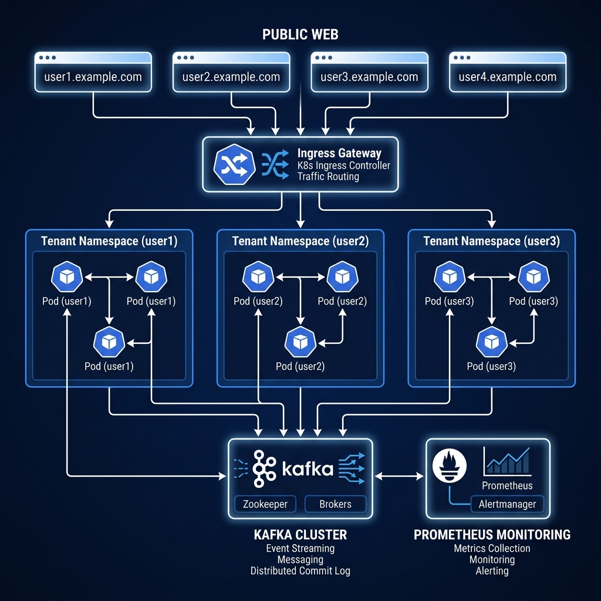

# 🚀 Multi-Tenant Kubernetes Web Hosting Platform

This project implements a complete, event-driven multi-tenant hosting system. It features isolated tenant namespaces, dynamic domain routing, automated CI/CD with rollbacks, and a full observability stack (Prometheus/Grafana/Kafka).

---

## 🏗️ System Architecture



---

## 🧠 Design Rationale & Engineering Decisions

This platform was built with a "Production-First" mindset. Here is the engineering logic behind our key components:

### 1. The Multi-Tenant Isolation Strategy
Instead of just using namespaces, we implemented a **Three-Layer Isolation** model:
*   **Logical**: Dedicated namespaces per tenant.
*   **Resource**: `ResourceQuotas` prevent "Noisy Neighbor" issues, ensuring one tenant's spike doesn't crash the entire cluster.
*   **Security**: `NetworkPolicies` ensure that tenant pods can only communicate with the Ingress Controller and Kafka, preventing cross-tenant data sniffing.

### 2. High-Availability & Dynamic Scaling (HPA)
We chose a **Horizontal Pod Autoscaling (HPA)** approach because web applications are typically CPU-bound during traffic spikes. 
*   **Targeting**: 50% CPU target ensures we have a "safety buffer" before the application experiences latency.
*   **Resilience**: By combining HPA with a `PodDisruptionBudget` (PDB), we guarantee that even during an auto-scale event or a node failure, at least one instance of the website is always serving traffic.

### 3. Observability & The "Metrics Labeling" Solution
A common issue in Kubernetes monitoring is losing pod/namespace metadata. 
*   **Engineering Fix**: We configured Prometheus to scrape the `/metrics/resource` endpoint on the nodes. This allows us to maintain strict `namespace` and `pod` labels even in a restricted environment like Minikube.
*   **Single-Pane-Of-Glass**: The custom Grafana dashboard uses **Template Variables** ($namespace), allowing an administrator to view the entire cluster or drill down into a single tenant's performance with one click.

### 4. Event-Driven CI/CD
We integrated **Kafka** directly into the deployment pipeline. 
*   **Reasoning**: In a real-world scenario, a deployment should trigger downstream events (e.g., clearing CDNs, notifying billing, or starting automated smoke tests). Our `WebsiteCreated` event serves as the decoupled trigger for these asynchronous operations.

---

## 📋 Table of Contents
1. [Prerequisites](#-prerequisites)
2. [Environment Setup](#-environment-setup)
3. [Infrastructure Deployment](#-infrastructure-deployment)
4. [CI/CD & Application Rollout](#-cicd--application-rollout)
5. [Observability & Monitoring](#-observability--monitoring)
6. [Testing & Verification](#-testing--verification)
7. [Cleanup](#-cleanup)

---

## 🛠 Prerequisites

Ensure you have the following installed on your Linux system:
*   **Minikube**: [Installation Guide](https://minikube.sigs.k8s.io/docs/start/)
*   **kubectl**: [Installation Guide](https://kubernetes.io/docs/tasks/tools/)
*   **Docker**: [Installation Guide](https://docs.docker.com/engine/install/)

---

## 🌐 Environment Setup

Initialize the Minikube cluster with the necessary resources and addons:

```bash
# Start Minikube with enough resources for Kafka and Monitoring
minikube start --driver=docker --cpus 4 --memory 8192

# Enable the NGINX Ingress Controller
minikube addons enable ingress

# Enable Metrics Server for HPA (Horizontal Pod Autoscaling)
minikube addons enable metrics-server
```

---

## 🏗 Infrastructure Deployment

Deploy the fundamental layers of the multi-tenant platform:

### 1. Namespaces & Security
Creates `user1`, `user2`, and `user3` namespaces along with `NetworkPolicies` to ensure tenant isolation:
```bash
kubectl apply -f k8s/namespaces.yaml
kubectl apply -f k8s/network-policy.yaml
```

### 2. Resource Management
Applies `ResourceQuotas` to prevent any single tenant from consuming all cluster resources:
```bash
kubectl apply -f k8s/resource-quota.yaml
```

### 3. Kafka Messaging Spine
Deploys a single-node Kafka cluster for the event-driven pipeline:
```bash
kubectl apply -f k8s/kafka.yaml
```

---

## 🚀 CI/CD & Application Rollout

The deployment is handled via an automated pipeline that manages the build-deploy-rollback lifecycle.

### 1. Build the Website Image
Point your terminal to Minikube's Docker daemon and build the app:
```bash
eval $(minikube docker-env)
docker build -t yotta-app:latest ./app
```

### 2. Run the Pipeline
The `pipeline.sh` script automates the deployment to all three namespaces, verifies the rollout, and triggers the `WebsiteCreated` event:
```bash
chmod +x ci-cd/pipeline.sh
./ci-cd/pipeline.sh
```

### 3. High Availability Policies
Apply the Autoscaling (HPA) and Stability (PDB) configurations:
```bash
kubectl apply -f k8s/hpa-pdb.yaml
```

---

## 📊 Observability & Monitoring

Deploy the "Golden Signals" monitoring stack to track tenant health:

### 1. Prometheus & Grafana
```bash
# Apply ConfigMaps for Dashboards and Datasources
kubectl apply -f monitoring/grafana-configs.yaml

# Deploy the monitoring services
kubectl apply -f monitoring/prometheus-config.yaml
kubectl apply -f monitoring/prometheus-grafana.yaml
```

### 2. Kafka Exporter
Enables monitoring of Kafka topic health and consumer lag:
```bash
kubectl apply -f monitoring/kafka-exporter.yaml
kubectl apply -f monitoring/kafka-consumer.yaml
```

---

## ✅ Testing & Verification

### 1. Domain Access (Hosts Entry)
Map the tenant domains to your Minikube IP:
```bash
echo "$(minikube ip) user1.example.com user2.example.com user3.example.com" | sudo tee -a /etc/hosts
```
Access the sites at: `https://user1.example.com`

### 2. Demonstrate Autoscaling (Load Test)
Run the load simulation and watch the HPA respond:
```bash
./scripts/load-test.sh
# Check scaling status
kubectl get hpa -A
```

### 3. Verify Kafka Events
Watch the automated `WebsiteCreated` events in real-time:
```bash
kubectl exec deployment/kafka -- kafka-console-consumer.sh --bootstrap-server localhost:9092 --topic deployment-events --from-beginning
```

### 4. Access Grafana Dashboard
Get the URL and login with `admin/admin`:
```bash
minikube service grafana -n default --url
```
Select the **"Multi-Tenant Platform Overview"** dashboard.

---

## 🧹 Cleanup
To tear down the environment:
```bash
minikube delete
```
